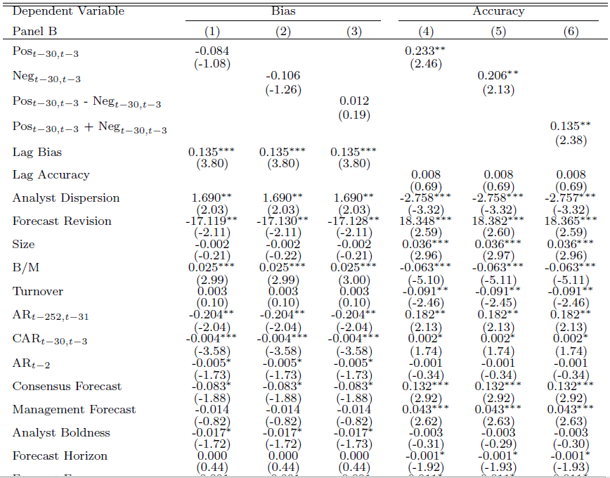

[](http://quantlet.de/index.php?p=info)

## [](http://quantlet.de/) **Accuracytable** [](http://quantlet.de/d3/ia)


```yaml
Name of QuantLet:  Accuracytable

Published in:      

Description:       'Generates table IV in "Is News Informative to Analysts?"'

Keywords:          'Media News, Tone, Sentiment, Information, Analysts'

See also:          'Accuracydata SUE SUEtable'

Author:            'Guo Li'

Submitted:         'Mon, September 5 2016 by Guo Li'

Datafile:          'accuracy1.dta'

Input:             'accuracy1.dta'

Output:  

Example:         
```





```Stata
cd C:\Users\~
*Pls download accuracy1.dta through following link: https://www.dropbox.com/s/d2r1dde2q3dm6b3/accuracy1.zip?dl=0
use accuracy1.dta
xi:areg wbias  pos1  lagwbias  i.fyear if horizon >3 & numaly>=4, a(cusip) cluster(cusip)
est store maa1
xi:areg wbias  neg1  lagwbias i.fyear if horizon >3 & numaly>=4, a(cusip) cluster(cusip)
est store maa2
xi:areg wbias  opt1  lagwbias   i.fyear if horizon >3 & numaly>=4, a(cusip) cluster(cusip)
est store maa3
xi:areg wbias  pos1 neg1  lagwbias   i.fyear if horizon >3 & numaly>=4, a(cusip) cluster(cusip)
est store maa4
xi:areg waccuracy  pos1  lagwaccuracy   i.fyear if horizon >3 & numaly>=4, a(cusip) cluster(cusip)
est store maa5
xi:areg waccuracy  neg1  lagwaccuracy i.fyear if horizon >3 & numaly>=4, a(cusip) cluster(cusip)
est store maa6
xi:areg waccuracy  posneg1  lagwaccuracy  i.fyear if horizon >3 & numaly>=4, a(cusip) cluster(cusip)
est store maa7
xi:areg waccuracy  pos1 neg1  lagwaccuracy  i.fyear if horizon >3 & numaly>=4, a(cusip) cluster(cusip)
est store maa8
esttab maa1 maa2 maa3  maa5 maa6 maa7  using 201608Accuracy1.tex, nogaps replace t b(%10.5f) ar2 star (*  0.10  ** 0.05   *** 0.01)


xi:areg wbias  pos1  lagwbias wconsensusdispersion wrevision  sizeq1 wbtomf wturnover walpha_252 wcar_30 wcar_2 wconsensusforecast     bold  horizon forecast_freq  rlexp rlfirmexp firm_coverage  relativerank   lnum  esq1 wvolatility mktret1 wownership   cigdummy   leverage24 momcig24 i  woverconfidence hardinfo i.fyear if horizon >3 & numaly >=4, a(cusip) cluster(cusip)
est store maa1
xi:areg wbias  neg1  lagwbias wconsensusdispersion wrevision  sizeq1 wbtomf wturnover walpha_252 wcar_30 wcar_2 wconsensusforecast     bold  horizon forecast_freq  rlexp rlfirmexp firm_coverage  relativerank   lnum  esq1 wvolatility mktret1 wownership   cigdummy   leverage24 momcig24 i  woverconfidence hardinfo i.fyear if horizon >3 & numaly >=4, a(cusip) cluster(cusip)
est store maa2
xi:areg wbias  opt1  lagwbias wconsensusdispersion wrevision  sizeq1 wbtomf wturnover walpha_252 wcar_30 wcar_2 wconsensusforecast     bold  horizon forecast_freq  rlexp rlfirmexp firm_coverage  relativerank   lnum  esq1 wvolatility mktret1 wownership   cigdummy   leverage24 momcig24 i  woverconfidence hardinfo i.fyear if horizon >3 & numaly >=4, a(cusip) cluster(cusip)
est store maa3
xi:areg wbias  pos1 neg1  lagwbias wconsensusdispersion wrevision  sizeq1 wbtomf wturnover walpha_252 wcar_30 wcar_2 wconsensusforecast     bold  horizon forecast_freq  rlexp rlfirmexp firm_coverage  relativerank   lnum  esq1 wvolatility mktret1 wownership   cigdummy   leverage24 momcig24 i  woverconfidence hardinfo i.fyear if horizon >3 & numaly >=4, a(cusip) cluster(cusip)
est store maa4
xi:areg waccuracy  pos1  lagwaccuracy wconsensusdispersion wrevision  sizeq1 wbtomf wturnover walpha_252 wcar_30 wcar_2 wconsensusforecast     bold  horizon forecast_freq  rlexp rlfirmexp firm_coverage  relativerank   lnum  esq1 wvolatility mktret1 wownership   cigdummy   leverage24 momcig24 i  woverconfidence hardinfo i.fyear if horizon >3 & numaly >=4, a(cusip) cluster(cusip)
est store maa5
xi:areg waccuracy  neg1  lagwaccuracy wconsensusdispersion wrevision  sizeq1 wbtomf wturnover walpha_252 wcar_30 wcar_2 wconsensusforecast     bold  horizon forecast_freq  rlexp rlfirmexp firm_coverage  relativerank   lnum  esq1 wvolatility mktret1 wownership   cigdummy   leverage24 momcig24 i  woverconfidence hardinfo i.fyear if horizon >3 & numaly >=4, a(cusip) cluster(cusip)
est store maa6
xi:areg waccuracy  posneg1  lagwaccuracy wconsensusdispersion wrevision  sizeq1 wbtomf wturnover walpha_252 wcar_30 wcar_2 wconsensusforecast     bold  horizon forecast_freq  rlexp rlfirmexp firm_coverage  relativerank   lnum  esq1 wvolatility mktret1 wownership   cigdummy   leverage24 momcig24 i  woverconfidence hardinfo i.fyear if horizon >3 & numaly >=4, a(cusip) cluster(cusip)
est store maa7
xi:areg waccuracy  pos1 neg1  lagwaccuracy wconsensusdispersion wrevision  sizeq1 wbtomf wturnover walpha_252 wcar_30 wcar_2 wconsensusforecast     bold  horizon forecast_freq  rlexp rlfirmexp firm_coverage  relativerank   lnum  esq1 wvolatility mktret1 wownership   cigdummy   leverage24 momcig24 i  woverconfidence hardinfo i.fyear if horizon >3 & numaly >=4, a(cusip) cluster(cusip)
est store maa8
esttab maa1 maa2 maa3  maa5 maa6 maa7  using 201608Accuracy2.tex, nogaps replace t(2) b(3)   ar2 star (*  0.10  ** 0.05   *** 0.01)


```
